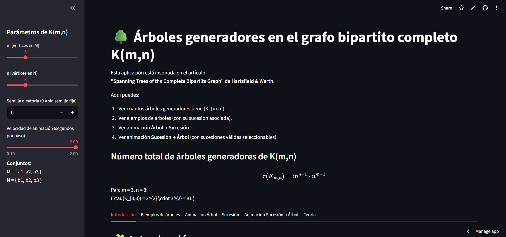

# 🌳 Visualizador interactivo de árboles generadores en \(K_{m,n}\)

Herramienta interactiva en **Python + Streamlit** para explorar los árboles generadores del grafo bipartito completo \(K_{m,n}\).  
La app muestra:

- El número total de árboles generadores usando la fórmula \(\tau(K_{m,n}) = m^{n-1} n^{m-1}\).
- Hasta **10 árboles generadores distintos** (por limitación visual).
- Una simulación **paso a paso** de cómo se construye la sucesión asociada a un árbol (árbol → sucesión).

---

## 🚀 Demo en línea

 **App desplegada en Streamlit:**  
[🔗 Abrir visualizador](https://TU-URL-DE-STREAMLIT.streamlit.app)

> Si el enlace no funciona, puede que la app esté dormida. Solo recarga o vuelve a intentar en unos segundos.

---

## 🖼️ Vista previa

 Agrega una captura de pantalla de tu app en una carpeta `img/` y pon aquí algo así:



---

## ✨ Características principales

- ✅ Cálculo automático de \(\tau(K_{m,n}) = m^{n-1} n^{m-1}\).
- ✅ Visualización de hasta **10 árboles generadores** de forma aleatoria.
- ✅ Dibujo bipartito ordenado: nodos de \(M\) y \(N\) en lados opuestos.
- ✅ Simulación **interactiva** Árbol → Sucesión:
  - Se eliminan hojas paso a paso.
  - Se resalta el vecino que entra a la sucesión.
  - Se muestra la sucesión parcial y final.

---

## 🧠 Fundamento matemático

El proyecto se basa en el resultado del artículo:

> *“Spanning Trees of the Complete Bipartite Graph”* — Hartsfield.

El teorema principal establece que el número de árboles generadores de \(K_{m,n}\) es:

\[
\tau(K_{m,n}) = m^{n-1} \cdot n^{m-1}.
\]

La demostración se apoya en construir una **biyección** entre:

- Árboles generadores de \(K_{m,n}\), y  
- Ciertas sucesiones de vértices de longitud \(m+n-2\).

Esta app ayuda a visualizar precisamente ese proceso.

---

## 🛠️ Tecnologías utilizadas

- 🐍 **Python 3**
- 🎈 **Streamlit**
- 📊 **NetworkX**
- 🖼️ **Matplotlib**

---

## 💻 Cómo ejecutar el proyecto localmente

```bash
# 1. Clonar el repositorio
git clone https://github.com/TU-USUARIO/TU-REPO.git
cd TU-REPO

# 2. (Opcional) Crear entorno virtual
python -m venv venv
source venv/bin/activate   # Linux/Mac
venv\Scripts\activate      # Windows

# 3. Instalar dependencias
pip install -r requirements.txt

# 4. Ejecutar la app
streamlit run app.py
